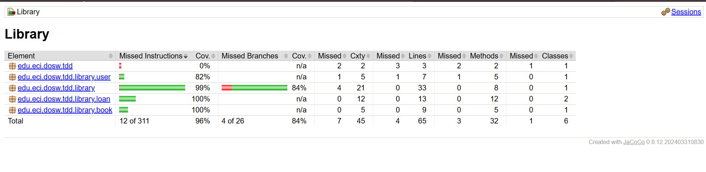
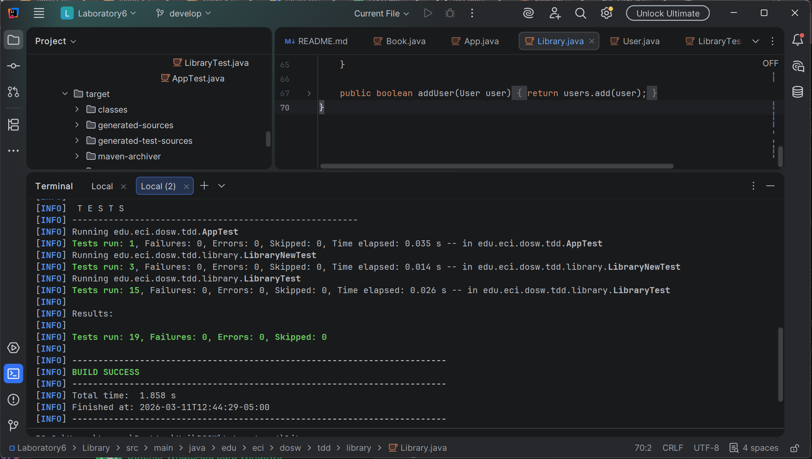
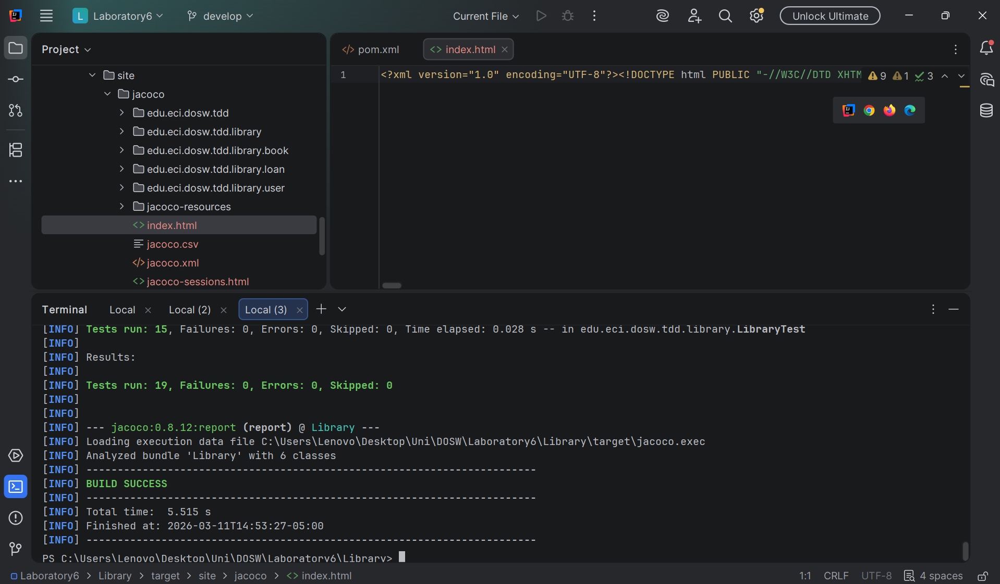
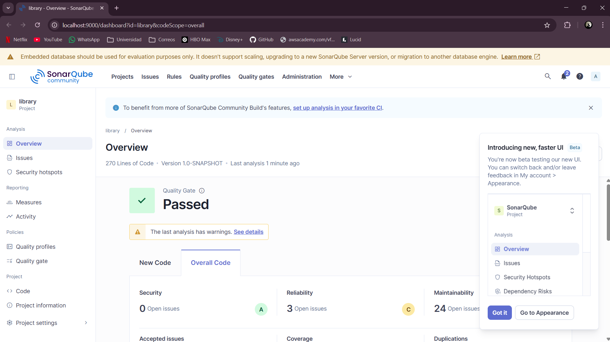

# DOSW Laboratory 6 – Library Management System (TDD)

## **Semester:** 2026-1

---

## **Team Members**

| **Member** | **GitHub** | **Contact** |
|---|---|---|
| **Juan Angel Salas Gomez** | [@Juanangels1403](https://github.com/Juanangels1403) | [juan.salas@mail.escuelaing.edu.co](mailto:juan.salas@mail.escuelaing.edu.co) |
| **Maria Juliana Rodriguez Caicedo** | [@JuliRodC](https://github.com/JuliRodC) | [maria.rodriguez@mail.escuelaing.edu.co](mailto:maria.rodriguez@mail.escuelaing.edu.co) |
| **Kevyn Daniel Forero Gonzalez** | [@kevyn1005](https://github.com/kevyn1005) | [kevyn.forero@mail.escuelaing.edu.co](mailto:kevyn.forero@mail.escuelaing.edu.co) |
| **Diego Alejandro Montes Bonilla** | [@Banettchi](https://github.com/Banettchi) | [diego.montes@mail.escuelaing.edu.co](mailto:diego.montes@mail.escuelaing.edu.co) |

---

## **Case Study: Library Management System**

This laboratory implements a library management system using the **TDD (Test-Driven Development)** methodology. The system allows managing books, users, and loans, ensuring code quality through unit tests and coverage measured with JaCoCo integrated with SonarQube.

---

## **Project Structure**

```
DOSW_LAB6/
├── .gitignore
├── README.md
├── Images/
│   ├── Capture1.png          ← Execution / test screenshots
│   ├── Capture2.png          ← Execution / test screenshots
│   ├── Capture3.png          ← JaCoCo coverage report
│   ├── image2.png            ← Additional evidence
│   └── image3.png            ← Additional evidence
└── Library/
    ├── pom.xml
    └── src/
        ├── main/java/edu/eci/dosw/tdd/
        │   ├── App.java
        │   └── library/
        │       ├── Library.java
        │       ├── book/
        │       │   └── Book.java
        │       ├── loan/
        │       │   ├── Loan.java
        │       │   └── LoanStatus.java
        │       └── user/
        │           └── User.java
        └── test/java/edu/eci/dosw/tdd/
            ├── AppTest.java
            └── library/
                ├── LibraryTest.java
                └── LibraryNewTest.java
```

---

## **Technologies and Tools**

| Tool | Version | Purpose |
|---|---|---|
| Java | 17 | Programming language |
| Maven | 3.x | Dependency management and build |
| JUnit Jupiter | 5.12.0 | Unit testing framework |
| JaCoCo | 0.8.12 | Code coverage measurement |
| SonarQube | Local | Static quality analysis |

---

## **Compilation and Execution**

**Compile the project:**
```bash
mvn clean compile
```

**Run tests:**
```bash
mvn test
```

**Generate JaCoCo coverage report:**
```bash
mvn verify
```

**Analyze with SonarQube:**
```bash
mvn sonar:sonar
```

---

## **Part 1 – Domain Class Design**

The library system is composed of the following main entities:

### Main Classes

| Class | Package | Description |
|---|---|---|
| `Library` | `edu.eci.dosw.tdd.library` | Core class: manages books, users, and loans |
| `Book` | `edu.eci.dosw.tdd.library.book` | Represents a book with title, author, and ISBN |
| `Loan` | `edu.eci.dosw.tdd.library.loan` | Represents a loan with dates and status |
| `LoanStatus` | `edu.eci.dosw.tdd.library.loan` | Enum with states: `ACTIVE`, `RETURNED` |
| `User` | `edu.eci.dosw.tdd.library.user` | Represents a user with ID and name |

### Methods of the `Library` Class

| Method | Description |
|---|---|
| `addBook(Book book)` | Adds a book to the catalog. Returns `false` if the book or its attributes are null |
| `loanABook(String userId, String isbn)` | Registers a loan. Returns `null` if the user does not exist, the book is unavailable, or already has an active loan |
| `returnLoan(Loan loan)` | Processes the return of a loan. Updates the status to `RETURNED` |
| `addUser(User user)` | Registers a new user in the system |

---

## **Part 2 – TDD Development**

The laboratory follows the TDD cycle: **Red → Green → Refactor**.

### Workflow per Team Member

Each member worked on their own feature branch and submitted a Pull Request to `develop`:

| Member | Branch | Contribution |
|---|---|---|
| Juan Angel Salas | `feature/add-book_JuanSalas` | Test case for the `addBook` method |
| Maria Juliana Rodriguez | `feature/library-tdd-Juliana` | Additional tests for loans and users |
| Kevyn Daniel Forero | `feature/library-tdd-Kevyn` | Validation tests and edge cases |
| Diego Alejandro Montes | `feature/library-tdd-Diego` | Return tests |

### Test Classes

#### `LibraryNewTest.java`
```java
@Test
public void shouldNotAddBookWithNullAuthor() {
    Book book = new Book("Clean Code", null, "ISBN-003");
    assertFalse(library.addBook(book));
}

@Test
public void shouldLoanCorrectBook() {
    // Verifies that the loaned book matches the one requested
}

@Test
public void shouldHaveReturnedStatusAfterReturn() {
    // Verifies that the loan status is RETURNED after the return
}
```

---

## **Part 3 – Code Coverage**

Code coverage is measured with **JaCoCo** and reported to **SonarQube**.

### Configuration in `pom.xml`

```xml
<plugin>
    <groupId>org.jacoco</groupId>
    <artifactId>jacoco-maven-plugin</artifactId>
    <version>0.8.12</version>
    <executions>
        <execution><goals><goal>prepare-agent</goal></goals></execution>
        <execution>
            <id>report</id>
            <phase>test</phase>
            <goals><goal>report</goal></goals>
        </execution>
    </executions>
</plugin>
```

### JaCoCo Coverage Report



---

## **Part 4 – Execution Evidence**

### Screenshot 1



### Screenshot 2



### Screenshot 3


### Screenshot 4


### Screenshot 5

